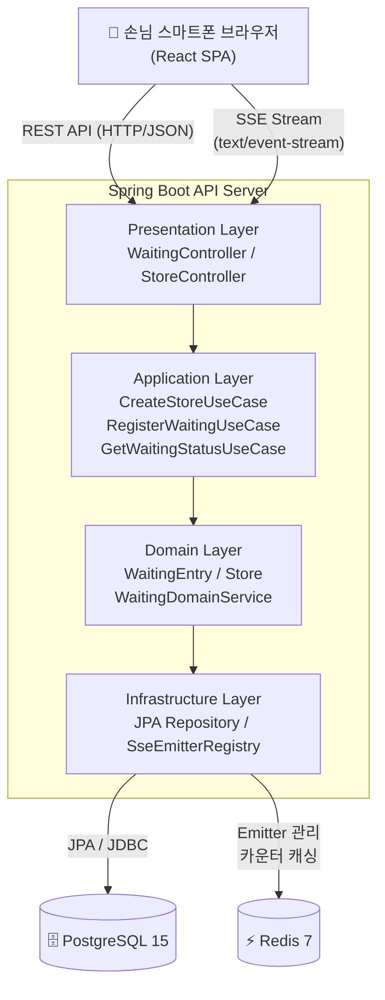

# TRD — QR 웨이팅 서비스

| 항목    | 내용                                         |
|-------|--------------------------------------------|
| 문서 유형 | Technical Requirements Document            |
| 버전    | v1.0.0                                     |
| 상태    | Draft                                      |
| 작성일   | 2026년 03월 24일                              |
| 연관 문서 | [QRWait_PRD_v1.0.md](./QRWait_PRD_v1.0.md) |

> **문서 목적:** PRD에서 정의된 기능 요구사항을 기술적으로 구현하기 위한 아키텍처, API, 데이터베이스, 실시간 통신 설계를 명세합니다.
>
> **기술 스택:** Spring Boot 3.x (Backend) + React 18 (Frontend) + PostgreSQL + Redis

---

## 1. 시스템 아키텍처

QR 웨이팅 서비스는 클라이언트-서버 구조로, React SPA가 Spring Boot REST API 서버와 통신합니다. 실시간 대기 순서 업데이트는 **Server-Sent Events (SSE)** 를 활용합니다. SSE는 WebSocket 대비
단방향(서버→클라이언트) 스트리밍에 적합하며, 별도 프로토콜 업그레이드 없이 HTTP로 동작하여 인프라 복잡도가 낮습니다.

### 레이어 구성

| 레이어        | 구성요소                 | 역할                                |
|------------|----------------------|-----------------------------------|
| Client     | React 18 (Vite)      | QR 랜딩 페이지, 웨이팅 등록 폼, 실시간 대기 현황 UI |
| API Server | Spring Boot 3.x      | 웨이팅 CRUD REST API, SSE 엔드포인트 제공   |
| Realtime   | Spring SseEmitter    | 대기 순서 변경 이벤트를 연결된 클라이언트에 Push     |
| Database   | PostgreSQL 15        | 매장, 웨이팅 데이터 영속 저장                 |
| Cache      | Redis 7              | SSE Emitter 관리, 대기 순서 카운터 캐싱      |
| Infra      | Docker Compose (MVP) | 로컬/단일 서버 환경 컨테이너 구성               |

### 아키텍처 다이어그램



---

## 2. 기술 스택 상세

| 분류                | 기술                          | 버전       | 선택 이유                                |
|-------------------|-----------------------------|----------|--------------------------------------|
| Backend Framework | Spring Boot                 | 3.3.x    | 팀 친숙도, 생태계, Spring SSE 네이티브 지원       |
| 언어                | Java                        | 21 LTS   | Virtual Thread (Loom) 활용 가능, LTS 안정성 |
| ORM               | Spring Data JPA + Hibernate | 6.x      | 엔티티 매핑, 쿼리 간소화                       |
| DB                | PostgreSQL                  | 15       | 신뢰성, JSON 지원, 오픈소스                   |
| Cache             | Redis                       | 7.x      | SSE Emitter 인스턴스 관리, 카운터 원자 연산       |
| 실시간               | Spring SseEmitter           | —        | 단방향 Push에 적합, HTTP 기반으로 인프라 부담 낮음    |
| Frontend          | React + Vite                | 18 / 5.x | SPA, 빠른 빌드, 팀 표준                     |
| 상태관리              | Zustand 또는 Context API      | —        | 경량 상태관리, MVP 단계 오버엔지니어링 방지           |
| API 스타일           | REST                        | —        | 단순 CRUD + SSE 조합으로 충분                |
| 컨테이너              | Docker + Docker Compose     | —        | MVP 단일 서버 배포                         |

---

## 3. 도메인 모델 및 데이터베이스 설계

### 핵심 엔티티

| 엔티티                | 주요 필드                                                                                     | 설명                                             |
|--------------------|-------------------------------------------------------------------------------------------|------------------------------------------------|
| Store (매장)         | id (UUID), name, qrCode (String)                                                          | QR 코드 값은 매장 등록 시 UUID로 생성                      |
| WaitingEntry (웨이팅) | id (UUID), storeId, visitorName, partySize, waitingNumber (int), status (ENUM), createdAt | status: WAITING / CALLED / ENTERED / CANCELLED |

### DDL

```sql
-- stores
CREATE TABLE stores
(
    id         UUID PRIMARY KEY DEFAULT gen_random_uuid(),
    name       VARCHAR(100)       NOT NULL,
    qr_code    VARCHAR(36) UNIQUE NOT NULL,
    created_at TIMESTAMP        DEFAULT now()
);

-- waiting_entries
CREATE TABLE waiting_entries
(
    id             UUID PRIMARY KEY     DEFAULT gen_random_uuid(),
    store_id       UUID        NOT NULL REFERENCES stores (id),
    visitor_name   VARCHAR(50) NOT NULL,
    party_size     INT         NOT NULL CHECK (party_size BETWEEN 1 AND 10),
    waiting_number INT         NOT NULL,
    status         VARCHAR(20) NOT NULL DEFAULT 'WAITING',
    created_at     TIMESTAMP            DEFAULT now()
);

CREATE INDEX idx_waiting_store_status ON waiting_entries (store_id, status);
```

---

## 4. REST API 설계

### 엔드포인트 목록

| Method | Endpoint                                | 설명                  | Auth |
|--------|-----------------------------------------|---------------------|------|
| POST   | `/api/stores`                           | 매장 등록 (QR 코드 자동 생성) | 없음   |
| GET    | `/api/stores/{qrCode}`                  | QR코드로 매장 정보 조회      | 없음   |
| POST   | `/api/stores/{storeId}/waitings`        | 웨이팅 등록              | 없음   |
| GET    | `/api/waitings/{waitingId}`             | 내 웨이팅 상세 조회         | 토큰   |
| GET    | `/api/stores/{storeId}/waitings/status` | 매장 전체 대기 현황 조회      | 없음   |
| GET    | `/api/waitings/{waitingId}/stream`      | SSE: 실시간 순서 업데이트 구독 | 토큰   |
| DELETE | `/api/waitings/{waitingId}`             | 웨이팅 취소              | 토큰   |
| GET    | `/api/stores/{storeId}/qr`              | QR 코드 이미지(PNG) 반환   | 없음   |

### 웨이팅 등록 API 상세

**POST** `/api/stores/{storeId}/waitings`

Request Body:

```json
{
  "visitorName": "이민지",
  "partySize": 2
}
```

Response `201 Created`:

```json
{
  "waitingId": "550e8400-e29b-41d4-a716-446655440000",
  "waitingNumber": 7,
  "currentRank": 3,
  "totalWaiting": 5,
  "estimatedWaitMinutes": 15,
  "waitingToken": "eyJ..."
}
```

### 매장 등록 API 상세

**POST** `/api/stores`

Request Body:

```json
{
  "name": "맛있는 식당"
}
```

Response `201 Created`:

```json
{
  "storeId": "a1b2c3d4-e5f6-7890-abcd-ef1234567890",
  "name": "맛있는 식당",
  "qrUrl": "https://qrwait.com/wait?storeId=a1b2c3d4-e5f6-7890-abcd-ef1234567890"
}
```

---

## 5. 실시간 통신 설계 (SSE)

실시간 대기 순서 업데이트는 **Server-Sent Events (SSE)** 로 구현합니다. 클라이언트는 `GET /api/waitings/{waitingId}/stream` 에 연결하고, 서버는 앞 팀의 상태 변경(입장/취소) 시 해당 매장의
모든 SSE 연결 클라이언트에 이벤트를 Push합니다.

### SSE 이벤트 구조

```
event: waiting-update
data: {"currentRank": 2, "totalWaiting": 4, "estimatedWaitMinutes": 10}

event: called
data: {"message": "입장해 주세요!"}
```

### SseEmitter 관리 전략

- SseEmitter는 `storeId` 단위로 `Map<UUID, List<SseEmitter>>`로 메모리 관리
- 연결 해제(타임아웃/오류) 시 `onCompletion` / `onTimeout` 콜백으로 Emitter 제거
- 타임아웃 기본값: **30분** (웨이팅 최대 대기 시간 가정)
- MVP 단계에서는 단일 서버 가정, 멀티 인스턴스 확장 시 Redis Pub/Sub로 전환 고려

---

## 6. 패키지 구조 (클린 아키텍처)

Spring Boot 백엔드는 **클린 아키텍처**를 기반으로 계층을 분리합니다. 도메인 로직이 인프라(JPA, Redis)에 의존하지 않도록 인터페이스로 역전합니다.

```
com.qrwait
├── domain/
│   ├── model/          # WaitingEntry, Store (순수 도메인 객체)
│   ├── repository/     # WaitingRepository, StoreRepository (인터페이스)
│   └── service/        # WaitingDomainService (핵심 비즈니스 로직)
├── application/
│   ├── usecase/        # RegisterWaitingUseCase, GetWaitingStatusUseCase
│   └── dto/            # Request/Response DTO
├── infrastructure/
│   ├── persistence/    # JPA Entity, JpaRepository 구현체
│   ├── redis/          # RedisWaitingRepository, SseEmitterRegistry
│   └── sse/            # WaitingSseService
└── presentation/
    ├── controller/     # WaitingController, StoreController
    └── advice/         # GlobalExceptionHandler
```

---

## 7. 프론트엔드 구조 (React)

### 페이지 구성

| 페이지                | 경로                            | 역할                    |
|--------------------|-------------------------------|-----------------------|
| OwnerPage          | `/owner`                      | 매장명 입력 → 매장 등록 API 호출 → QR 코드 이미지 표시 |
| LandingPage        | `/wait?storeId={id}`          | 매장 정보 표시, 웨이팅 등록 폼    |
| WaitingConfirmPage | `/waiting/{waitingId}`        | 등록 완료 확인, 웨이팅 번호 표시   |
| WaitingStatusPage  | `/waiting/{waitingId}/status` | 실시간 대기 순서 표시 (SSE 연결) |
| CancelPage         | `/waiting/{waitingId}/cancel` | 웨이팅 취소 확인             |

### SSE 클라이언트 구현

```javascript
const eventSource = new EventSource(
    `/api/waitings/${waitingId}/stream`,
    {withCredentials: false}
);

eventSource.addEventListener('waiting-update', (e) => {
    const data = JSON.parse(e.data);
    setCurrentRank(data.currentRank);
});

eventSource.addEventListener('called', (e) => {
    const data = JSON.parse(e.data);
    setMessage(data.message);
});

// 컴포넌트 언마운트 시 연결 해제
return () => eventSource.close();
```

---

## 8. 배포 구성 (MVP)

MVP 단계에서는 **Docker Compose** 로 단일 서버에 전체 스택을 구성합니다.

```yaml
services:
  api: # Spring Boot JAR
    build: ./backend
    ports:
      - "8080:8080"
    depends_on:
      - db
      - redis
    environment:
      - SPRING_DATASOURCE_URL=jdbc:postgresql://db:5432/qrwait
      - SPRING_REDIS_HOST=redis

  frontend: # React (Nginx)
    build: ./frontend
    ports:
      - "80:80"

  db: # PostgreSQL 15
    image: postgres:15
    environment:
      - POSTGRES_DB=qrwait
      - POSTGRES_USER=qrwait
      - POSTGRES_PASSWORD=secret
    volumes:
      - postgres_data:/var/lib/postgresql/data

  redis: # Redis 7
    image: redis:7-alpine

volumes:
  postgres_data:
```

---

## 9. Phase 로드맵

| Phase         | 내용                                             | 타겟    |
|---------------|------------------------------------------------|-------|
| Phase 1 (MVP) | QR 웨이팅 등록 + 실시간 순서 확인 (B2C)                    | 현재 문서 |
| Phase 2       | 점주 대시보드, SMS/카카오 알림, 회원가입                      | v2.0  |
| Phase 3       | 날짜/시간 예약, 다중 매장, 결제 연동                         | v3.0  |
| Phase 4       | Kubernetes 마이그레이션, 멀티 인스턴스 SSE (Redis Pub/Sub) | v4.0  |