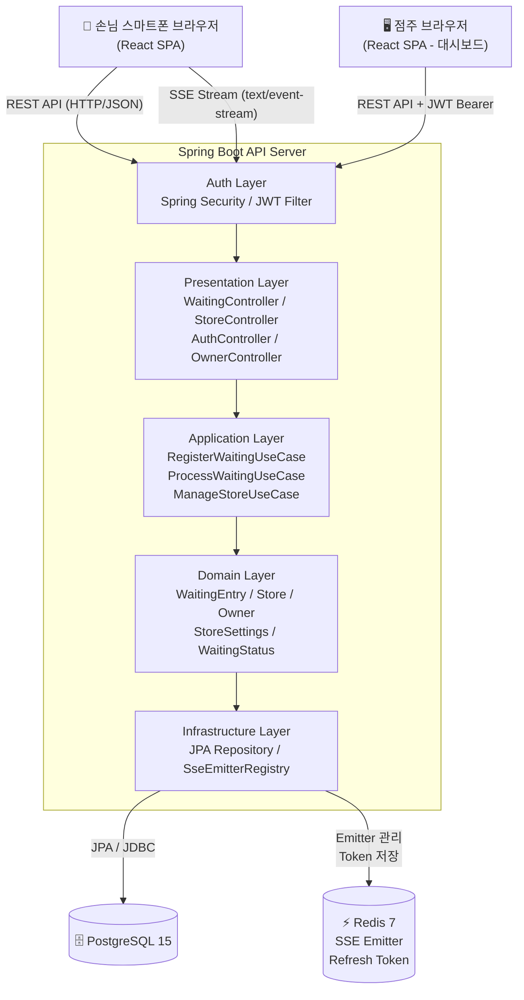
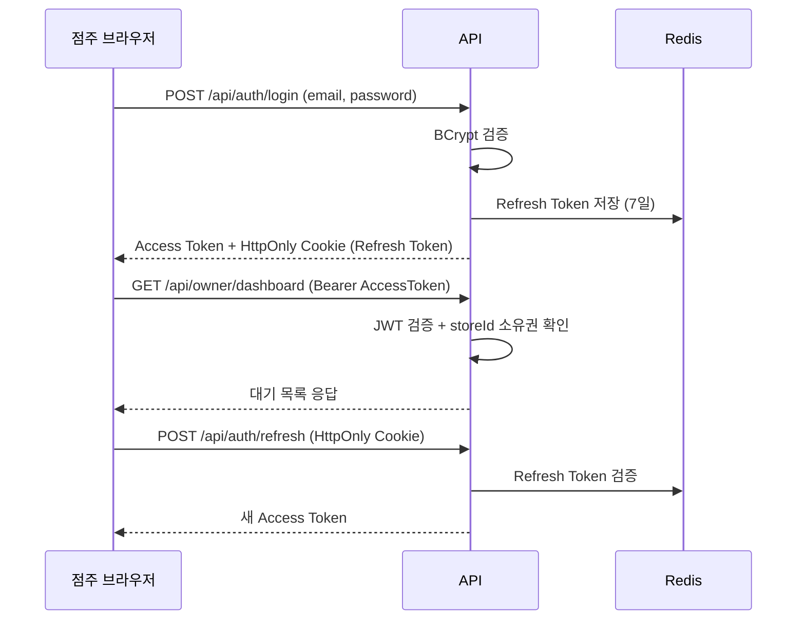

# TRD — QR 웨이팅 서비스

| 항목    | 내용                                                 |
|-------|----------------------------------------------------|
| 문서 유형 | Technical Requirements Document                    |
| 버전    | v2.0.0                                             |
| 상태    | Draft                                              |
| 작성일   | 2026년 04월 03일                                      |
| 연관 문서 | [QRWait_PRD_v2.0.md](./QRWait_PRD_v2.0.md)         |
| 변경 이력 | v1.0 → v2.0: 점주 인증, 대시보드 API, DB 신규 엔티티, 패키지 구조 확장 |

> **문서 목적:** PRD v2.0에서 정의된 점주 기능 요구사항을 기술적으로 구현하기 위한 인증, API, 데이터베이스, 프론트엔드 설계를 명세합니다.
>
> **기술 스택:** Spring Boot 3.x (Backend) + React 18 (Frontend) + PostgreSQL + Redis

---

## 1. 시스템 아키텍처

기존 클라이언트-서버 구조에 **점주 브라우저(대시보드)** 클라이언트와 **JWT 인증 레이어**가 추가됩니다. 핵심 아키텍처(SSE, 클린 아키텍처, Docker Compose)는 변경 없이 유지됩니다.

### 레이어 구성

| 레이어         | 구성요소                  | 역할                                   |
|-------------|-----------------------|--------------------------------------|
| Client (손님) | React 18 (Vite)       | QR 랜딩, 웨이팅 등록, 실시간 대기 현황             |
| Client (점주) | React 18 (Vite)       | 회원가입/로그인, 대시보드, 매장 설정                |
| Auth        | Spring Security + JWT | 점주 API 접근 제어, 토큰 발급/검증               |
| API Server  | Spring Boot 3.x       | 웨이팅 CRUD, 점주 운영 API, SSE 엔드포인트       |
| Realtime    | Spring SseEmitter     | 대기 순서 변경 이벤트 Push (손님·점주 모두)         |
| Database    | PostgreSQL 15         | 사용자, 매장, 웨이팅, 설정 데이터 영속 저장           |
| Cache       | Redis 7               | SSE Emitter 관리, JWT Refresh Token 저장 |
| Infra       | Docker Compose        | 단일 서버 컨테이너 구성                        |

### 아키텍처 다이어그램



---

## 2. 기술 스택 상세

| 분류                | 기술                          | 버전       | 선택 이유                                |
|-------------------|-----------------------------|----------|--------------------------------------|
| Backend Framework | Spring Boot                 | 3.3.x    | 팀 친숙도, 생태계, Spring SSE 네이티브 지원       |
| 언어                | Java                        | 21 LTS   | Virtual Thread (Loom) 활용 가능, LTS 안정성 |
| 인증                | Spring Security + JJWT      | 0.12.x   | JWT 발급/검증, API 접근 제어                 |
| ORM               | Spring Data JPA + Hibernate | 6.x      | 엔티티 매핑, 쿼리 간소화                       |
| DB                | PostgreSQL                  | 15       | 신뢰성, JSON 지원, 오픈소스                   |
| Cache             | Redis                       | 7.x      | SSE Emitter 관리, Refresh Token 저장     |
| 실시간               | Spring SseEmitter           | —        | 단방향 Push에 적합, HTTP 기반                |
| Frontend          | React + Vite                | 18 / 5.x | SPA, 빠른 빌드, 팀 표준                     |
| 상태관리              | Zustand                     | —        | 경량 상태관리                              |
| API 스타일           | REST                        | —        | CRUD + SSE 조합으로 충분                   |
| 컨테이너              | Docker + Docker Compose     | —        | MVP 단일 서버 배포                         |

---

## 3. 도메인 모델 및 데이터베이스 설계

### 핵심 엔티티

| 엔티티                   | 주요 필드                                                                                                 | 설명                                                |
|-----------------------|-------------------------------------------------------------------------------------------------------|---------------------------------------------------|
| Owner (점주)            | id (UUID), email, passwordHash, createdAt                                                             | 점주 계정. 이메일/비밀번호 기반 인증                             |
| Store (매장)            | id (UUID), ownerId, name, address, status (ENUM), createdAt                                           | 매장의 정체성 데이터. status: OPEN / BREAK / FULL / CLOSED |
| StoreSettings (매장 설정) | id (UUID), storeId, tableCount, avgTurnoverMinutes, openTime, closeTime, alertThreshold, alertEnabled | 운영 설정값. 점주가 수시로 변경하는 값들                           |
| WaitingEntry (웨이팅)    | id (UUID), storeId, visitorName, partySize, waitingNumber (int), status (ENUM), createdAt             | status: WAITING / CALLED / ENTERED / CANCELLED    |

### 예상 대기시간 계산 공식

```
예상 대기시간(분) = avgTurnoverMinutes ÷ tableCount × 앞 대기팀 수
```

예시: 평균 이용시간 30분, 테이블 5개, 앞 대기 3팀 → `30 ÷ 5 × 3 = 18분`

### DDL (신규/변경 테이블)

```sql
-- owners (신규)
CREATE TABLE owners
(
  id            UUID PRIMARY KEY DEFAULT gen_random_uuid(),
  email         VARCHAR(255) UNIQUE NOT NULL,
  password_hash VARCHAR(255)        NOT NULL,
  created_at    TIMESTAMP        DEFAULT now()
);

-- stores (변경: owner_id, address, status 포함 / businessType 제거)
-- status는 손님 QR 스캔 시 단순 조회가 잦아 stores에 유지
-- 점주가 상태 변경 시 단순 UPDATE: UPDATE stores SET status = ? WHERE id = ?
CREATE TABLE stores
(
  id         UUID PRIMARY KEY      DEFAULT gen_random_uuid(),
  owner_id   UUID         NOT NULL REFERENCES owners (id),
  name       VARCHAR(100) NOT NULL,
  address    VARCHAR(255),
  status     VARCHAR(20)  NOT NULL DEFAULT 'OPEN',
  created_at TIMESTAMP             DEFAULT now()
);

CREATE INDEX idx_stores_owner ON stores (owner_id);

-- store_settings (신규)
-- openTime / closeTime: 운영 상황에 따라 변경되는 설정값이므로 store_settings에 위치
-- tableCount, avgTurnoverMinutes: 예상 대기시간 계산 기준값
CREATE TABLE store_settings
(
  id                   UUID PRIMARY KEY     DEFAULT gen_random_uuid(),
  store_id             UUID UNIQUE NOT NULL REFERENCES stores (id),
  table_count          INT         NOT NULL DEFAULT 5,
  avg_turnover_minutes INT         NOT NULL DEFAULT 30,
  open_time            TIME,
  close_time           TIME,
  alert_threshold      INT         NOT NULL DEFAULT 10,
  alert_enabled        BOOLEAN     NOT NULL DEFAULT true
);

-- waiting_entries (기존 유지)
CREATE TABLE waiting_entries
(
  id             UUID PRIMARY KEY     DEFAULT gen_random_uuid(),
  store_id       UUID        NOT NULL REFERENCES stores (id),
  visitor_name   VARCHAR(50) NOT NULL,
  party_size     INT         NOT NULL CHECK (party_size BETWEEN 1 AND 10),
  waiting_number INT         NOT NULL,
  status         VARCHAR(20) NOT NULL DEFAULT 'WAITING',
  created_at     TIMESTAMP            DEFAULT now()
);

CREATE INDEX idx_waiting_store_status ON waiting_entries (store_id, status);
```

---

## 4. 인증 설계 (JWT)

### 토큰 전략

| 구분            | 만료시간 | 저장 위치                                |
|---------------|------|--------------------------------------|
| Access Token  | 1시간  | 클라이언트 메모리 (Zustand)                  |
| Refresh Token | 7일   | Redis (서버) + HttpOnly Cookie (클라이언트) |

- Access Token은 LocalStorage에 저장하지 않음 (XSS 방어)
- Refresh Token은 Redis에 저장하여 서버 측 무효화 가능
- 모든 점주 전용 API는 `Authorization: Bearer {accessToken}` 헤더 필수

### 인증 흐름



---

## 5. REST API 설계

### 기존 엔드포인트 (Phase 1, 유지)

| Method | Endpoint                                | 설명                | Auth |
|--------|-----------------------------------------|-------------------|------|
| GET    | `/api/stores/{storeId}`                 | storeId로 매장 정보 조회 | 없음   |
| POST   | `/api/stores/{storeId}/waitings`        | 웨이팅 등록            | 없음   |
| GET    | `/api/waitings/{waitingId}`             | 내 웨이팅 상세 조회       | 없음   |
| GET    | `/api/stores/{storeId}/waitings/status` | 매장 전체 대기 현황 조회    | 없음   |
| GET    | `/api/waitings/{waitingId}/stream`      | SSE: 실시간 순서 업데이트  | 없음   |
| DELETE | `/api/waitings/{waitingId}`             | 손님 웨이팅 취소         | 없음   |
| GET    | `/api/stores/{storeId}/qr`              | QR 코드 이미지(PNG) 반환 | 없음   |

### 신규 엔드포인트 (Phase 2)

**인증**

| Method | Endpoint            | 설명                       | Auth                   |
|--------|---------------------|--------------------------|------------------------|
| POST   | `/api/auth/signup`  | 점주 회원가입                  | 없음                     |
| POST   | `/api/auth/login`   | 점주 로그인 → JWT 발급          | 없음                     |
| POST   | `/api/auth/logout`  | 로그아웃 → Refresh Token 무효화 | JWT                    |
| POST   | `/api/auth/refresh` | Access Token 재발급         | Refresh Token (Cookie) |

**매장 관리**

| Method | Endpoint                        | 설명                                    | Auth |
|--------|---------------------------------|---------------------------------------|------|
| POST   | `/api/owner/stores`             | 매장 등록                                 | JWT  |
| GET    | `/api/owner/stores/me`          | 내 매장 정보 조회                            | JWT  |
| PUT    | `/api/owner/stores/me`          | 매장 정보 수정                              | JWT  |
| GET    | `/api/owner/stores/me/settings` | 매장 설정 조회                              | JWT  |
| PUT    | `/api/owner/stores/me/settings` | 매장 설정 수정 (테이블 수, 회전 시간, 알림)           | JWT  |
| PUT    | `/api/owner/stores/me/status`   | 매장 웨이팅 상태 변경 (OPEN/BREAK/FULL/CLOSED) | JWT  |

**대시보드 운영**

| Method | Endpoint                                 | 설명                           | Auth |
|--------|------------------------------------------|------------------------------|------|
| GET    | `/api/owner/stores/me/waitings`          | 현재 대기 목록 조회 (WAITING/CALLED) | JWT  |
| GET    | `/api/owner/stores/me/waitings/summary`  | 오늘 통계 요약 (등록/입장/노쇼/취소 건수)    | JWT  |
| POST   | `/api/owner/waitings/{waitingId}/call`   | 손님 호출 (WAITING → CALLED)     | JWT  |
| POST   | `/api/owner/waitings/{waitingId}/enter`  | 입장 처리 (CALLED → ENTERED)     | JWT  |
| POST   | `/api/owner/waitings/{waitingId}/noshow` | 노쇼 처리 (→ CANCELLED)          | JWT  |
| GET    | `/api/owner/stores/me/dashboard/stream`  | SSE: 대시보드 실시간 갱신             | JWT  |

### 매장 설정 수정 API 상세

**PUT** `/api/owner/stores/me/settings`

Request Body:

```json
{
  "tableCount": 8,
  "avgTurnoverMinutes": 25,
  "alertThreshold": 10,
  "alertEnabled": true
}
```

Response `200 OK`:

```json
{
  "tableCount": 8,
  "avgTurnoverMinutes": 25,
  "alertThreshold": 10,
  "alertEnabled": true,
  "estimatedWaitFormulaExample": "25 ÷ 8 × 대기팀수 = 예상 대기시간(분)"
}
```

---

## 6. 실시간 통신 설계 (SSE)

기존 손님 대상 SSE에 더해 **점주 대시보드 전용 SSE 채널**이 추가됩니다.

### 손님 SSE (기존 유지)

```
event: waiting-update
data: {"currentRank": 2, "totalWaiting": 4, "estimatedWaitMinutes": 10}

event: called
data: {"message": "입장해 주세요!"}

event: store-status-changed
data: {"status": "BREAK", "message": "현재 브레이크타임입니다"}
```

### 점주 대시보드 SSE (신규)

```
event: waiting-registered
data: {"waitingId": "...", "visitorName": "이민지", "partySize": 2, "waitingNumber": 7, "totalWaiting": 7}

event: waiting-updated
data: {"waitingId": "...", "status": "CANCELLED", "totalWaiting": 6}

event: alert-threshold-reached
data: {"totalWaiting": 10, "message": "대기 팀이 10팀을 초과했습니다."}
```

### SseEmitter 관리 전략

- 손님용: `Map<UUID, List<SseEmitter>>` — storeId 단위 관리 (기존 유지)
- 점주용: `Map<UUID, SseEmitter>` — storeId당 점주 1명 연결 (단일 점주 가정)
- Refresh Token 만료로 점주 SSE 연결이 끊어지면 재로그인 유도

---

## 7. 패키지 구조 (클린 아키텍처)

기존 구조를 유지하면서 `auth`, `owner` 관련 패키지를 확장합니다.

```
com.qrwait
├── domain/
│   ├── model/
│   │   ├── WaitingEntry.java       # 기존 유지
│   │   ├── Store.java              # status 필드 유지 (손님 QR 스캔 시 단순 조회를 위해 stores 테이블에 위치)
│   │   ├── Owner.java              # 신규
│   │   ├── StoreSettings.java      # 신규 (tableCount, avgTurnoverMinutes, openTime, closeTime, alertThreshold, alertEnabled)
│   │   └── WaitingStatus.java      # 기존 유지
│   ├── repository/
│   │   ├── WaitingRepository.java  # 기존 유지
│   │   ├── StoreRepository.java    # 기존 유지
│   │   ├── OwnerRepository.java    # 신규
│   │   └── StoreSettingsRepository.java  # 신규
│   └── service/
│       └── WaitingDomainService.java     # 기존 유지
├── application/
│   ├── usecase/
│   │   ├── RegisterWaitingUseCase.java   # 기존 (매장 status 검증 추가)
│   │   ├── GetWaitingStatusUseCase.java  # 기존 (예상시간 계산 공식 변경)
│   │   ├── SignUpOwnerUseCase.java        # 신규
│   │   ├── LoginOwnerUseCase.java         # 신규
│   │   ├── ProcessWaitingUseCase.java     # 신규 (호출/입장/노쇼 통합)
│   │   ├── UpdateStoreStatusUseCase.java  # 신규
│   │   └── UpdateStoreSettingsUseCase.java # 신규
│   └── dto/                        # 기존 + 신규 DTO 추가
├── infrastructure/
│   ├── persistence/                # 기존 + OwnerJpaEntity, StoreSettingsJpaEntity 추가
│   ├── redis/                      # 기존 + RefreshTokenRepository 추가
│   └── sse/
│       ├── WaitingSseService.java  # 기존 (점주 SSE 채널 추가)
│       └── SseEmitterRegistry.java # 기존 (점주용 Map 추가)
└── presentation/
    ├── controller/
    │   ├── WaitingController.java  # 기존 유지
    │   ├── StoreController.java    # 기존 유지
    │   ├── AuthController.java     # 신규
    │   └── OwnerController.java    # 신규
    ├── advice/
    │   └── GlobalExceptionHandler.java  # 기존 + 401/403 처리 추가
    └── security/
        ├── JwtTokenProvider.java   # 신규
        ├── JwtAuthFilter.java      # 신규
        └── SecurityConfig.java     # 신규
```

---

## 8. 프론트엔드 구조 (React)

### 페이지 구성

| 페이지                | 경로                            | 역할                    | 인증  |
|--------------------|-------------------------------|-----------------------|-----|
| LandingPage        | `/wait?storeId={id}`          | 매장 정보 표시, 웨이팅 등록 폼    | 없음  |
| WaitingConfirmPage | `/waiting/{waitingId}`        | 등록 완료 확인, 웨이팅 번호 표시   | 없음  |
| WaitingStatusPage  | `/waiting/{waitingId}/status` | 실시간 대기 순서 표시 (SSE)    | 없음  |
| CancelPage         | `/waiting/{waitingId}/cancel` | 웨이팅 취소 확인             | 없음  |
| OwnerSignupPage    | `/owner/signup`               | 점주 회원가입 + 매장 정보 입력    | 없음  |
| OwnerLoginPage     | `/owner/login`                | 점주 로그인                | 없음  |
| OnboardingPage     | `/owner/onboarding`           | 가입 후 QR 인쇄 안내, 설정 가이드 | JWT |
| DashboardPage      | `/owner/dashboard`            | 실시간 대기 목록, 입장/노쇼 처리   | JWT |
| StoreSettingsPage  | `/owner/settings`             | 테이블 수, 회전 시간, 알림 설정   | JWT |

### 점주 인증 처리

- Access Token은 Zustand store에 저장 (메모리)
- 앱 초기 로드 시 `/api/auth/refresh` 호출하여 Access Token 복구 (Refresh Token은 HttpOnly Cookie)
- JWT 만료 시 axios 인터셉터에서 자동으로 refresh 시도
- refresh 실패 시 로그인 페이지로 리다이렉트

---

## 9. 배포 구성 (변경 없음)

기존 Docker Compose 구성을 유지합니다. JWT Secret Key 및 환경변수만 추가됩니다.

```yaml
services:
  api:
    build: ./backend
    ports:
      - "8080:8080"
    depends_on:
      - db
      - redis
    environment:
      - SPRING_DATASOURCE_URL=jdbc:postgresql://db:5432/qrwait
      - SPRING_REDIS_HOST=redis
      - JWT_SECRET=your-secret-key-here          # 신규
      - JWT_ACCESS_EXPIRY=3600                    # 신규 (초 단위)
      - JWT_REFRESH_EXPIRY=604800                 # 신규 (초 단위)

  frontend:
    build: ./frontend
    ports:
      - "80:80"

  db:
    image: postgres:15
    environment:
      - POSTGRES_DB=qrwait
      - POSTGRES_USER=qrwait
      - POSTGRES_PASSWORD=secret
    volumes:
      - postgres_data:/var/lib/postgresql/data

  redis:
    image: redis:7-alpine

volumes:
  postgres_data:
```

---

## 10. Phase 로드맵

| Phase        | 내용                                             | 타겟   |
|--------------|------------------------------------------------|------|
| Phase 1 (완료) | QR 웨이팅 등록 + 실시간 순서 확인 (B2C)                    | v1.0 |
| Phase 2 (현재) | 점주 회원가입, 대시보드, 입장/노쇼 처리, 매장 설정                 | v2.0 |
| Phase 3      | 직원 계정/권한 관리, SMS/카카오 알림, 일별 통계, 다중 매장          | v3.0 |
| Phase 4      | 날짜/시간 예약, 결제 연동                                | v4.0 |
| Phase 5      | Kubernetes 마이그레이션, 멀티 인스턴스 SSE (Redis Pub/Sub) | v5.0 |
